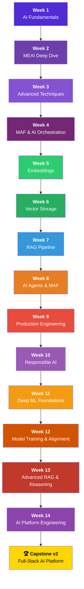

<div align="center">


# 🧠 Dotnet AI Engineer Roadmap
### Master the Modern AI Stack with C# and .NET 10

[](https://dotnet.microsoft.com/)
[](https://github.com/microsoft/agent-framework)
[](https://learn.microsoft.com/semantic-kernel/)
[](./LICENSE)
[](./CONTRIBUTING.md)
[](https://github.com/itsrajkumar/AI-Engineer-With-.Net)

---

**Learn to build production-grade AI applications using your existing .NET expertise.**
*Skip the Python-heavy tutorials. Direct path for C# engineers, from first API call to model adaptation, RAG, agents, and production deployment.*

> 🆕 **v4.0 — June 2026 Refresh** — Updated for current Microsoft Foundry guidance, GPT-5.5/5.6 models, richer evaluation, MCP v1.4, MAF 1.0 GA, and deep ML foundations (build from scratch).

[Explore Roadmap](#roadmap-overview) • [Quick Start](#getting-started) • [Tech Stack](#tech-stack) • [Contribute](./CONTRIBUTING.md)

</div>

---

## 🎯 The Mission
This community-driven roadmap is designed for **.NET developers** who want to transition into **AI Engineering**. We focus on real-world architecture, mapping every AI concept directly to C# code using the latest Microsoft tools.

### Why this roadmap?
- 🚀 **C#-First**: No switching to Python for model orchestration.
- 🏗️ **Architectural Focus**: Learn RAG, Agents, MCP, and Vector Storage patterns.
- 🛠️ **Modern Stack**: Built with .NET 10, Microsoft.Extensions.AI (v10.7.0), and Microsoft Agent Framework (1.0 GA).
- 🆕 **v4 Content**: Includes building models from scratch, advanced RAG, A2A Protocol, and AI Platform Engineering.
- 📐 **14 Weeks, 70 Days**: Comprehensive coverage with zero gaps in AI Engineering expertise from beginner to expert.

---

## 🗺️ Roadmap Overview



---

## 📚 Table of Contents

### [📋 Prerequisites](./00-Prerequisites/README.md)
Setup your development environment, Azure account, and required tools.

---

### [Week 1: AI Fundamentals & The .NET API Layer](./Week-01-AI-Fundamentals-and-DotNet-API-Layer/README.md)
| Day | Topic | Type |
|-----|-------|------|
| 1 | [AI Theory & Terminology](./Week-01-AI-Fundamentals-and-DotNet-API-Layer/Day-01-AI-Theory-and-Terminology/README.md) | 📖 Theory |
| 2 | [Prompt Engineering Basics](./Week-01-AI-Fundamentals-and-DotNet-API-Layer/Day-02-Prompt-Engineering-Basics/README.md) | 📖 Theory + Practice |
| 3 | [Microsoft.Extensions.AI](./Week-01-AI-Fundamentals-and-DotNet-API-Layer/Day-03-Microsoft-Extensions-AI/README.md) | 💻 Code |
| 4 | [Your First API Connection](./Week-01-AI-Fundamentals-and-DotNet-API-Layer/Day-04-First-API-Connection/README.md) | 💻 Code |
| 5 | [System Prompts & Roles](./Week-01-AI-Fundamentals-and-DotNet-API-Layer/Day-05-System-Prompts-and-Roles/README.md) | 💻 Code |

### 🆕 [Week 2: Microsoft.Extensions.AI — Deep Dive](./Week-02-MEAI-Deep-Dive/README.md)
| Day | Topic | Type |
|-----|-------|------|
| 1 | [IChatClient & Provider Abstraction](./Week-02-MEAI-Deep-Dive/Day-01-IChatClient-Provider-Abstraction/README.md) | 💻 Code |
| 2 | [Streaming & Async Patterns](./Week-02-MEAI-Deep-Dive/Day-02-Streaming-and-Async-Patterns/README.md) | 💻 Code |
| 3 | [Structured Output](./Week-02-MEAI-Deep-Dive/Day-03-Structured-Output/README.md) | 💻 Code |
| 4 | [Function Calling with MEAI](./Week-02-MEAI-Deep-Dive/Day-04-Function-Calling-With-MEAI/README.md) | 💻 Code |
| 5 | [Middleware Pipelines](./Week-02-MEAI-Deep-Dive/Day-05-Middleware-Pipelines/README.md) | 💻 Code |

### 🆕 [Week 3: Advanced AI Techniques](./Week-03-Advanced-AI-Techniques/README.md)
| Day | Topic | Type |
|-----|-------|------|
| 1 | [Multimodal AI (Vision & Images)](./Week-03-Advanced-AI-Techniques/Day-01-Multimodal-AI/README.md) | 💻 Code |
| 2 | [Local Models & Providers](./Week-03-Advanced-AI-Techniques/Day-02-Local-Models-and-Providers/README.md) | 💻 Code |
| 3 | [Fine-Tuning Concepts](./Week-03-Advanced-AI-Techniques/Day-03-Fine-Tuning-Concepts/README.md) | 📖 Theory |
| 4 | [Advanced Prompt Engineering](./Week-03-Advanced-AI-Techniques/Day-04-Advanced-Prompt-Engineering/README.md) | 📖 Theory + Code |
| 5 | [AI Evaluation Basics](./Week-03-Advanced-AI-Techniques/Day-05-AI-Evaluation-Basics/README.md) | 💻 Code |

### [Week 4: MAF & AI Orchestration (SK Migration)](./Week-02-Semantic-Kernel-Orchestrator/README.md)
| Day | Topic | Type |
|-----|-------|------|
| 1 | [Kernel Architecture](./Week-02-Semantic-Kernel-Orchestrator/Day-01-Kernel-Architecture/README.md) | 💻 Code |
| 2 | [Semantic Functions](./Week-02-Semantic-Kernel-Orchestrator/Day-02-Semantic-Functions/README.md) | 💻 Code |
| 3 | [Native C# Plugins](./Week-02-Semantic-Kernel-Orchestrator/Day-03-Native-CSharp-Plugins/README.md) | 💻 Code |
| 4 | [Tool Calling (Function Calling)](./Week-02-Semantic-Kernel-Orchestrator/Day-04-Tool-Calling/README.md) | 💻 Code |
| 5 | [State & History Management](./Week-02-Semantic-Kernel-Orchestrator/Day-05-State-and-History/README.md) | 💻 Code |

### [Week 5: Embeddings & Data Processing](./Week-03-Embeddings-and-Data-Processing/README.md)
| Day | Topic | Type |
|-----|-------|------|
| 1 | [Embedding Theory](./Week-03-Embeddings-and-Data-Processing/Day-01-Embedding-Theory/README.md) | 📖 Theory |
| 2 | [Generating Embeddings in .NET](./Week-03-Embeddings-and-Data-Processing/Day-02-Generating-Embeddings-DotNet/README.md) | 💻 Code |
| 3 | [Document Chunking Strategies](./Week-03-Embeddings-and-Data-Processing/Day-03-Document-Chunking/README.md) | 💻 Code |
| 4 | [Cosine Similarity](./Week-03-Embeddings-and-Data-Processing/Day-04-Cosine-Similarity/README.md) | 💻 Code |
| 5 | [Batch Processing Pipeline](./Week-03-Embeddings-and-Data-Processing/Day-05-Batch-Processing-Pipeline/README.md) | 💻 Code |

### [Week 6: Vector Storage & Semantic Search](./Week-04-Vector-Storage-and-Semantic-Search/README.md)
| Day | Topic | Type |
|-----|-------|------|
| 1 | [Vector Database Fundamentals](./Week-04-Vector-Storage-and-Semantic-Search/Day-01-Vector-DB-Fundamentals/README.md) | 📖 Theory |
| 2 | [Document DB & Vector Search](./Week-04-Vector-Storage-and-Semantic-Search/Day-02-Document-DB-Vector-Search/README.md) | 💻 Code |
| 3 | [Relational DB & Vectors](./Week-04-Vector-Storage-and-Semantic-Search/Day-03-Relational-DB-Vectors/README.md) | 💻 Code |
| 4 | [Hybrid Search Integration](./Week-04-Vector-Storage-and-Semantic-Search/Day-04-Hybrid-Search/README.md) | 💻 Code |
| 5 | [C# Repository Pattern for Vectors](./Week-04-Vector-Storage-and-Semantic-Search/Day-05-Repository-Pattern-Vectors/README.md) | 💻 Code |

### [Week 7: Building the RAG Pipeline](./Week-05-RAG-Pipeline/README.md)
| Day | Topic | Type |
|-----|-------|------|
| 1 | [RAG Architecture Review](./Week-05-RAG-Pipeline/Day-01-RAG-Architecture/README.md) | 📖 Theory |
| 2 | [The Retrieval Step](./Week-05-RAG-Pipeline/Day-02-Retrieval-Step/README.md) | 💻 Code |
| 3 | [The Augmentation Step](./Week-05-RAG-Pipeline/Day-03-Augmentation-Step/README.md) | 💻 Code |
| 4 | [End-to-End RAG Implementation](./Week-05-RAG-Pipeline/Day-04-End-to-End-RAG/README.md) | 💻 Code |
| 5 | [Handling Edge Cases](./Week-05-RAG-Pipeline/Day-05-Edge-Cases/README.md) | 💻 Code |

### 🆕 [Week 8: AI Agents & Microsoft Agent Framework](./Week-08-AI-Agents-and-MAF/README.md)
| Day | Topic | Type |
|-----|-------|------|
| 1 | [Agentic Architecture & Patterns](./Week-06-Autonomous-AI-Agents/Day-01-Agentic-Architecture/README.md) | 📖 Theory |
| 2 | [SK Planners → MAF Agents](./Week-06-Autonomous-AI-Agents/Day-02-SK-Planners/README.md) | 💻 Code |
| 3 | [Multi-Agent Workflows](./Week-08-AI-Agents-and-MAF/Day-03-Multi-Agent-Workflows/README.md) | 💻 Code |
| 4 | [Model Context Protocol (MCP)](./Week-08-AI-Agents-and-MAF/Day-04-Model-Context-Protocol/README.md) | 💻 Code |
| 5 | [Human-in-the-Loop & Safety](./Week-06-Autonomous-AI-Agents/Day-04-Human-in-the-Loop/README.md) | 💻 Code |

### 🆕 [Week 9: Production AI Engineering](./Week-09-Production-AI-Engineering/README.md)
| Day | Topic | Type |
|-----|-------|------|
| 1 | [AI-Powered ASP.NET Core APIs](./Week-09-Production-AI-Engineering/Day-01-AI-Powered-Web-APIs/README.md) | 💻 Code |
| 2 | [Observability & Monitoring](./Week-09-Production-AI-Engineering/Day-02-Observability-and-Monitoring/README.md) | 💻 Code |
| 3 | [Content Safety & Guardrails](./Week-09-Production-AI-Engineering/Day-03-Content-Safety-and-Guardrails/README.md) | 💻 Code |
| 4 | [AI Testing & Evaluation](./Week-09-Production-AI-Engineering/Day-04-AI-Testing-and-Evaluation/README.md) | 💻 Code |
| 5 | [.NET 10 Migration Guide](./Week-09-Production-AI-Engineering/Day-05-DotNet10-Migration-Guide/README.md) | 📖 Theory + Code |
| **6** | **[🆕 Hybrid LLM Strategy](./Week-09-Production-AI-Engineering/Day-06-Hybrid-LLM-Strategy/README.md)** | **🏗️ Architecture + Code** |

### 🆕 [Week 10: Responsible AI & Capstone](./Week-10-Responsible-AI-and-Capstone/README.md)
| Day | Topic | Type |
|-----|-------|------|
| 1 | [Responsible AI Principles](./Week-10-Responsible-AI-and-Capstone/Day-01-Responsible-AI-Principles/README.md) | 📖 Theory |
| 2 | [Bias Detection & Fairness](./Week-10-Responsible-AI-and-Capstone/Day-02-Bias-Detection-and-Fairness/README.md) | 💻 Code |
| 3 | [Security for AI Systems](./Week-10-Responsible-AI-and-Capstone/Day-03-Security-for-AI-Systems/README.md) | 💻 Code |
| 4 | [Capstone: Architecture & Setup](./Week-10-Responsible-AI-and-Capstone/Day-04-Capstone-Architecture/README.md) | 🏗️ Project |
| 5 | [Capstone: Build & Deploy](./Week-10-Responsible-AI-and-Capstone/Day-05-Capstone-Build-and-Deploy/README.md) | 🏗️ Project |

### 🆕 [Week 11: Deep ML Foundations](./Week-11-Deep-ML-Foundations/README.md)
| Day | Topic | Type |
|-----|-------|------|
| 1 | [ML Fundamentals Refresher](./Week-11-Deep-ML-Foundations/Day-01-ML-Fundamentals/README.md) | 📖 Theory |
| 2 | [Neural Networks from Scratch](./Week-11-Deep-ML-Foundations/Day-02-Neural-Networks-From-Scratch/README.md) | 💻 Code |
| 3 | [The Transformer Architecture](./Week-11-Deep-ML-Foundations/Day-03-Transformer-Architecture/README.md) | 📖 Theory |
| 4 | [Building a Mini-Transformer](./Week-11-Deep-ML-Foundations/Day-04-Mini-Transformer/README.md) | 💻 Code |
| 5 | [Modern Architectures](./Week-11-Deep-ML-Foundations/Day-05-Modern-Architectures/README.md) | 📖 Theory |

### 🆕 [Week 12: Model Training and Alignment](./Week-12-Model-Training-and-Alignment/README.md)
| Day | Topic | Type |
|-----|-------|------|
| 1 | [Pretraining & Datasets](./Week-12-Model-Training-and-Alignment/Day-01-Pretraining-and-Datasets/README.md) | 📖 Theory |
| 2 | [Supervised Fine-Tuning (SFT)](./Week-12-Model-Training-and-Alignment/Day-02-Supervised-Fine-Tuning/README.md) | 📖 Theory |
| 3 | [RLHF and DPO](./Week-12-Model-Training-and-Alignment/Day-03-RLHF-and-DPO/README.md) | 📖 Theory |
| 4 | [Parameter-Efficient Fine-Tuning](./Week-12-Model-Training-and-Alignment/Day-04-Parameter-Efficient-Fine-Tuning/README.md) | 📖 Theory |
| 5 | [Synthetic Data Generation](./Week-12-Model-Training-and-Alignment/Day-05-Synthetic-Data-Generation/README.md) | 💻 Code |

### 🆕 [Week 13: Advanced RAG and Agents](./Week-13-Advanced-RAG-and-Agents/README.md)
| Day | Topic | Type |
|-----|-------|------|
| 1 | [GraphRAG](./Week-13-Advanced-RAG-and-Agents/Day-01-GraphRAG/README.md) | 📖 Theory + Code |
| 2 | [RAPTOR and Self-RAG](./Week-13-Advanced-RAG-and-Agents/Day-02-RAPTOR-and-Self-RAG/README.md) | 📖 Theory |
| 3 | [Agent Swarms](./Week-13-Advanced-RAG-and-Agents/Day-03-Agent-Swarms/README.md) | 📖 Theory + Code |
| 4 | [Multi-Agent Frameworks](./Week-13-Advanced-RAG-and-Agents/Day-04-Multi-Agent-Frameworks/README.md) | 📖 Theory |
| 5 | [Agent Observability](./Week-13-Advanced-RAG-and-Agents/Day-05-Agent-Observability/README.md) | 💻 Code |

### 🆕 [Week 14: The MCP Ecosystem](./Week-14-MCP-Ecosystem/README.md)
| Day | Topic | Type |
|-----|-------|------|
| 1 | [MCP Architecture](./Week-14-MCP-Ecosystem/Day-01-MCP-Architecture/README.md) | 📖 Theory |
| 2 | [Building MCP Servers](./Week-14-MCP-Ecosystem/Day-02-Building-MCP-Servers/README.md) | 💻 Code |
| 3 | [MCP Clients in MAF](./Week-14-MCP-Ecosystem/Day-03-MCP-Clients-in-MAF/README.md) | 💻 Code |
| 4 | [Authentication & Security](./Week-14-MCP-Ecosystem/Day-04-Authentication-and-Security/README.md) | 💻 Code |
| 5 | [Enterprise Deployment](./Week-14-MCP-Ecosystem/Day-05-Enterprise-Deployment/README.md) | 🏗️ Project |

### [🏆 Capstone v2: Full-Stack AI Platform](./Capstone-Project/README.md)

---

## 🛠️ Tech Stack

| Category | Technology |
|----------|-----------|
| **Runtime** | .NET 10 (LTS) / C# 14 |
| **AI Abstraction** | Microsoft.Extensions.AI (v10.7.0 GA) |
| **AI Orchestrator** | Microsoft Agent Framework 1.0 GA |
| **LLM Provider** | Microsoft Foundry / Azure OpenAI / OpenAI / Ollama |
| **Embedding Model** | text-embedding-3-large, Qwen3-Embedding, Matryoshka models |
| **Vector Storage** | MongoDB Atlas / PostgreSQL (pgvector) / Pinecone / Weaviate |
| **Local Models** | Foundry Local v1.2, Ollama, Docker Model Runner, AI Toolkit |
| **Auth** | AzureCliCredential (Azure Identity) |
| **Observability** | OpenTelemetry, LangFuse, Arize Phoenix |
| **Protocols** | MCP v1.4.0+, A2A Protocol v1.0 |
| **Testing** | xUnit + NSubstitute + LLM-as-Judge + regression evals |
| **IDE** | Visual Studio 2022 / VS Code / JetBrains Rider |

---

## 🚀 Getting Started

```bash
# Clone the repository
git clone https://github.com/itsrajkumar/AI-Engineer-With-.Net.git
cd AI-Engineer-With-.Net

# Start with prerequisites
# Open 00-Prerequisites/README.md
```

> **Tip:** Each day's folder is self-contained. You can start any day independently if you already have the prerequisite knowledge.

---

## 📊 Progress Tracker

Use this checklist to track your progress:

- [ ] **Prerequisites** — Environment setup complete
<!-- Week 1 -->
- [ ] **Week 1, Day 1** — AI Theory & Terminology
- [ ] **Week 1, Day 2** — Prompt Engineering Basics
- [ ] **Week 1, Day 3** — Microsoft.Extensions.AI
- [ ] **Week 1, Day 4** — Your First API Connection
- [ ] **Week 1, Day 5** — System Prompts & Roles
<!-- Week 2 (NEW) -->
- [ ] **Week 2, Day 1** — IChatClient & Provider Abstraction 🆕
- [ ] **Week 2, Day 2** — Streaming & Async Patterns 🆕
- [ ] **Week 2, Day 3** — Structured Output 🆕
- [ ] **Week 2, Day 4** — Function Calling with MEAI 🆕
- [ ] **Week 2, Day 5** — Middleware Pipelines 🆕
<!-- Week 3 (NEW) -->
- [ ] **Week 3, Day 1** — Multimodal AI (Vision & Images) 🆕
- [ ] **Week 3, Day 2** — Local Models & Providers 🆕
- [ ] **Week 3, Day 3** — Fine-Tuning Concepts 🆕
- [ ] **Week 3, Day 4** — Advanced Prompt Engineering 🆕
- [ ] **Week 3, Day 5** — AI Evaluation Basics 🆕
<!-- Week 4 (was Week 2) -->
- [ ] **Week 4, Day 1** — Kernel Architecture
- [ ] **Week 4, Day 2** — Semantic Functions
- [ ] **Week 4, Day 3** — Native C# Plugins
- [ ] **Week 4, Day 4** — Tool Calling
- [ ] **Week 4, Day 5** — State & History Management
<!-- Week 5 (was Week 3) -->
- [ ] **Week 5, Day 1** — Embedding Theory
- [ ] **Week 5, Day 2** — Generating Embeddings in .NET
- [ ] **Week 5, Day 3** — Document Chunking Strategies
- [ ] **Week 5, Day 4** — Cosine Similarity
- [ ] **Week 5, Day 5** — Batch Processing Pipeline
<!-- Week 6 (was Week 4) -->
- [ ] **Week 6, Day 1** — Vector Database Fundamentals
- [ ] **Week 6, Day 2** — Document DB & Vector Search
- [ ] **Week 6, Day 3** — Relational DB & Vectors
- [ ] **Week 6, Day 4** — Hybrid Search Integration
- [ ] **Week 6, Day 5** — Repository Pattern for Vectors
<!-- Week 7 (was Week 5) -->
- [ ] **Week 7, Day 1** — RAG Architecture Review
- [ ] **Week 7, Day 2** — The Retrieval Step
- [ ] **Week 7, Day 3** — The Augmentation Step
- [ ] **Week 7, Day 4** — End-to-End RAG
- [ ] **Week 7, Day 5** — Handling Edge Cases
<!-- Week 8 (NEW — expanded agents) -->
- [ ] **Week 8, Day 1** — Agentic Architecture & Patterns
- [ ] **Week 8, Day 2** — SK Planners → MAF Agents
- [ ] **Week 8, Day 3** — Multi-Agent Workflows 🆕
- [ ] **Week 8, Day 4** — Model Context Protocol (MCP) 🆕
- [ ] **Week 8, Day 5** — Human-in-the-Loop & Safety
<!-- Week 9 (NEW) -->
- [ ] **Week 9, Day 1** — AI-Powered ASP.NET Core APIs 🆕
- [ ] **Week 9, Day 2** — Observability & Monitoring 🆕
- [ ] **Week 9, Day 3** — Content Safety & Guardrails 🆕
- [ ] **Week 9, Day 4** — AI Testing & Evaluation 🆕
- [ ] **Week 9, Day 5** — .NET 10 Migration Guide 🆕
- [ ] **Week 9, Day 6** — Hybrid LLM Strategy (Cloud-to-Local Migration) 🆕
<!-- Week 10 (NEW) -->
- [ ] **Week 10, Day 1** — Responsible AI Principles
- [ ] **Week 10, Day 2** — Bias Detection & Fairness 🆕
- [ ] **Week 10, Day 3** — Security for AI Systems 🆕
- [ ] **Week 10, Day 4** — Capstone: Architecture 🆕
- [ ] **Week 10, Day 5** — Capstone: Build & Deploy 🆕
<!-- Week 11 (NEW) -->
- [ ] **Week 11, Day 1** — ML Fundamentals Refresher 🆕
- [ ] **Week 11, Day 2** — Neural Networks from Scratch 🆕
- [ ] **Week 11, Day 3** — Transformer Architecture 🆕
- [ ] **Week 11, Day 4** — Building a Mini-Transformer 🆕
- [ ] **Week 11, Day 5** — Modern Architectures 🆕
<!-- Week 12 (NEW) -->
- [ ] **Week 12, Day 1** — Pretraining & Datasets 🆕
- [ ] **Week 12, Day 2** — Supervised Fine-Tuning 🆕
- [ ] **Week 12, Day 3** — RLHF and DPO 🆕
- [ ] **Week 12, Day 4** — Parameter-Efficient Fine-Tuning 🆕
- [ ] **Week 12, Day 5** — Synthetic Data Generation 🆕
<!-- Week 13 (NEW) -->
- [ ] **Week 13, Day 1** — GraphRAG 🆕
- [ ] **Week 13, Day 2** — RAPTOR and Self-RAG 🆕
- [ ] **Week 13, Day 3** — Agent Swarms 🆕
- [ ] **Week 13, Day 4** — Multi-Agent Frameworks 🆕
- [ ] **Week 13, Day 5** — Agent Observability 🆕
<!-- Week 14 (NEW) -->
- [ ] **Week 14, Day 1** — MCP Architecture 🆕
- [ ] **Week 14, Day 2** — Building MCP Servers 🆕
- [ ] **Week 14, Day 3** — MCP Clients in MAF 🆕
- [ ] **Week 14, Day 4** — Authentication & Security 🆕
- [ ] **Week 14, Day 5** — Enterprise Deployment 🆕

---

## 📖 References & Resources

- [Generative AI for Beginners .NET v2](https://github.com/microsoft/Generative-AI-for-beginners-dotnet) — Microsoft's official course (Updated March 2026)
- [Microsoft.Extensions.AI Overview](https://learn.microsoft.com/dotnet/ai/ai-extensions)
- [Microsoft Agent Framework](https://github.com/microsoft/agent-framework) — Multi-agent SDK
- [Model Context Protocol (MCP)](https://modelcontextprotocol.io/) — Open standard for AI tool connectivity
- [Microsoft Semantic Kernel Documentation](https://learn.microsoft.com/semantic-kernel/)
- [Azure OpenAI Service](https://learn.microsoft.com/azure/ai-services/openai/)
- [Microsoft Responsible AI](https://www.microsoft.com/ai/responsible-ai)
- [.NET 10 What's New](https://learn.microsoft.com/dotnet/core/whats-new/dotnet-10)
- [OpenAI API Reference](https://platform.openai.com/docs/api-reference)
- [Roadmap.sh AI Engineer Roadmap](https://roadmap.sh/ai-engineer)
- [Ollama](https://ollama.com) — Run LLMs locally
- [.NET MCP SDK](https://github.com/modelcontextprotocol/csharp-sdk) — MCP for .NET
- [A2A Protocol](https://github.com/a2a-protocol) — Agent-to-Agent communication
- [TorchSharp](https://github.com/dotnet/TorchSharp) — .NET bindings for PyTorch
- [ML.NET](https://dotnet.microsoft.com/en-us/apps/machinelearning-ai/ml-dotnet) — Machine Learning for .NET
- [ONNX Runtime](https://onnxruntime.ai/) — Cross-platform inferencing
- [DeepEval](https://github.com/confident-ai/deepeval) — LLM Evaluation
- [Promptfoo](https://www.promptfoo.dev/) — Prompt Evaluation
- [LangFuse](https://langfuse.com/) — LLM Observability

---

## 📄 License

This project is licensed under the MIT License — see the [LICENSE](./LICENSE) file for details.

---

## ⭐ Star This Repo

If you find this roadmap helpful, please give it a ⭐ on GitHub!
