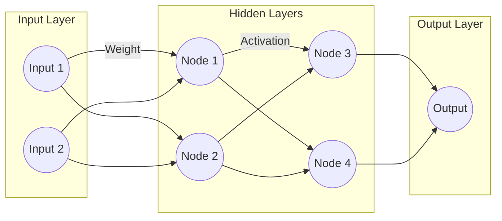
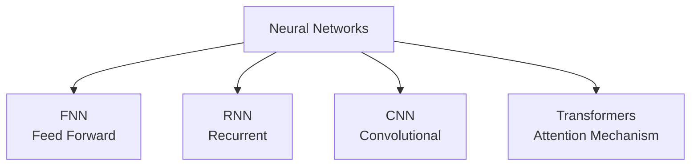

# Deep Learning & Neural Networks in .NET

Deep Learning is a specialized subfield of Machine Learning. It focuses on using complex algorithms modeled after the human brain known as **Artificial Neural Networks** to process data. 

While standard ML algorithms (like those in ML.NET's SDCA or FastTree) are excellent for structured, tabular data (like an Excel sheet or SQL Database), Deep Learning truly excels at handling **unstructured data**.

- Raw text documents (Natural Language)
- Audio files (Speech recognition)
- Unstructured Images (Computer Vision)
- Videos

## 🧠 Why Deep Learning in .NET?

Historically, Deep Learning workflows (training and inference) have heavily relied on Python frameworks like PyTorch or TensorFlow. However, the .NET ecosystem has advanced significantly. 

As a C# developer, you can integrate, infer, and even train Neural Networks entirely within your .NET applications using three primary paths:

1. **TorchSharp (`TorchSharp`):** A .NET binding to the PyTorch engine. You can write PyTorch-like code directly in C#.
2. **ONNX Runtime (`Microsoft.ML.OnnxRuntime`):** ONNX (Open Neural Network Exchange) is an open format built to represent machine learning models. You can train a model in PyTorch (or download one from Hugging Face), convert it to an `.onnx` file, and run high-performance inference natively in your .NET applications.
3. **ML.NET Deep Learning Integration:** ML.NET has APIs specifically designed to consume pre-trained deep learning models for image classification and object detection.

---

## 🛠️ How Neural Networks Work

A Neural Network is formed by layers of artificial neurons (nodes).



Training a neural network involves two major phases:

**1. Forward Propagation**
The network receives an input and makes a prediction. It calculates a weighted sum of inputs, adds a bias factor, and passes the entire result through an "Activation Function" (like Sigmoid or ReLU) to move the data down to the next layer. This is how the network "decides" if a neuron should trigger.

**2. Backward Propagation (Backprop)**
The model compares its raw prediction to the expected answer, calculating the discrepancy/error using a "Loss Function". It then moves *backward* through the layers, tweaking weights and biases to mathematically minimize that loss. This is essentially how the network "learns" from its mistakes.

---

## 🏗️ Key Neural Network Architectures

Different shapes of neural networks are adapted for different types of data.



### 1. FNN (Feed Forward Neural Networks)
The simplest architecture where data flows rigidly in one direction, from input to output, without looping back on itself.
- **Best Use Case:** Simple numerical predictions or static classifications.
- **.NET Example:** A dense, multi-layer Neural Network built using `TorchSharp` to classify basic multi-dimensional data arrays. 

### 2. RNN (Recurrent Neural Networks)
These networks contain internal loops, acting like a form of memory. They remember previous steps, making them powerful for handling sequence-dependent data.
- **Best Use Case:** Time-series forecasting or real-time speech translation where context from the preceding words matters.
- **.NET Example:** Forecasting monthly supply chain demands based on sequential historical telemetry using an RNN model consumed via `Microsoft.ML.OnnxRuntime`.

### 3. CNN (Convolutional Neural Networks)
These are mathematically designed to analyze grid-based visual data with extreme efficiency. They sweep small filters (kernels) over overlapping patches of pixels rather than analyzing every single pixel at once.
- **Best Use Case:** Image classification or object detection.
- **.NET Example:** Using `Microsoft.ML.Vision` (`mlContext.MulticlassClassification.Trainers.ImageClassification`) to retrain a ResNet model to classify defect images coming from a factory assembly line camera into categories like "Pass" or "Fail".

### 4. Transformers
The architecture that revolutionized modern AI. Instead of reading sequence data step-by-step (like RNNs), a Transformer digests the entire sequence simultaneously. It uses an "Attention Mechanism" to determine how heavily words (tokens) relate to each other, no matter how far apart they are in a sentence.
- **Best Use Case:** Large Language Models, complex text generation, deep contextual understanding.
- **.NET Example:** Communicating with a Transformer-based LLM (like GPT-4o or a local Phi-3 model) using `Microsoft.Extensions.AI` or `Microsoft.SemanticKernel` to power a conversational agent in your Blazor application.

---

## ⚙️ Running Deep Learning Inference in C# (ONNX Example)

To show how a .NET Developer typically interacts with Deep Learning, here is a simplified example of how you consume an ONNX-formatted Deep Learning model using the ONNX Runtime:

```csharp
using Microsoft.ML.OnnxRuntime;
using Microsoft.ML.OnnxRuntime.Tensors;

// 1. Load the pre-trained Deep Learning ONNX model into memory
using var session = new InferenceSession("model.onnx");

// 2. Prepare visual/multidimensional inputs as Tensors
var inputTensor = new DenseTensor<float>(new[] { 1, 3, 224, 224 }); // Example Image dimensions
var inputs = new List<NamedOnnxValue>
{
    NamedOnnxValue.CreateFromTensor("input", inputTensor)
};

// 3. Execution (Inference)
using IDisposableReadOnlyCollection<DisposableNamedOnnxValue> results = session.Run(inputs);

// 4. Retrieve Results
var output = results.First().AsTensor<float>();
Console.WriteLine($"Confidence Score: {output[0]}");
```

---

## 📚 Official Resources for Further Study
- [TorchSharp GitHub Repository](https://github.com/dotnet/TorchSharp)
- [ONNX Runtime for C# / .NET](https://onnxruntime.ai/docs/get-started/with-csharp.html)
- [Image Classification with ML.NET](https://learn.microsoft.com/en-us/dotnet/machine-learning/tutorials/image-classification)

---

### ➡️ Navigation
- Return to **[Main Timeline: Day 1 README](./README.md)**
- Previous Detailed Topic: **[Machine Learning Deep Dive](./Machine-Learning-Deep-Dive.md)**
- Next Detailed Topic: **[Generative AI & NLP](./Generative-AI-and-NLP.md)**
