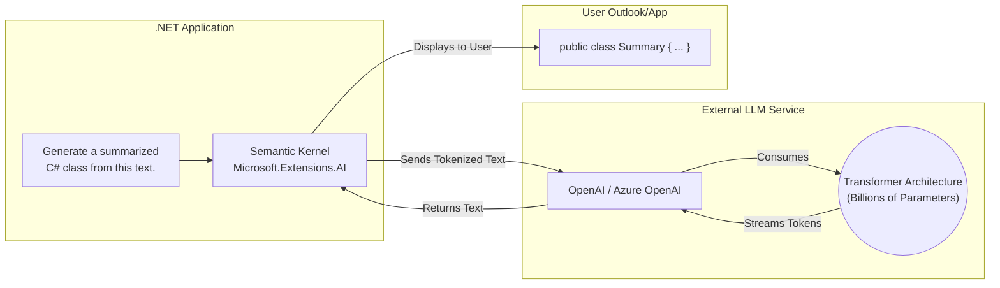
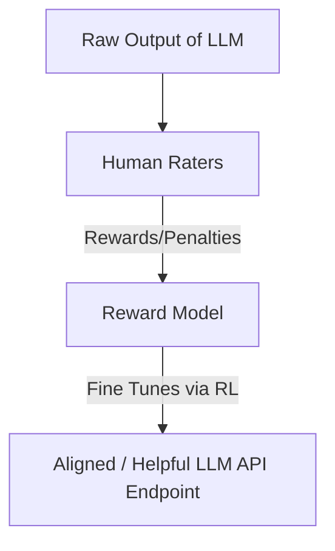

# Generative AI, NLP, and Computer Vision in .NET

Generative AI (GenAI) is a major branch of AI focused on *generating* brand-new, original content rather than just predicting or classifying existing data.

While traditional Machine Learning might predict if an image contains a dog versus a cat, GenAI will *create entirely new images* of a dog that has never existed.

- **Text:** ChatGPT (OpenAI), Claude (Anthropic), Gemini (Google)
- **Code:** GitHub Copilot, Cursor
- **Images:** Midjourney, DALL-E 3
- **Video:** OpenAI Sora, RunwayML

As a .NET Developer, you will primarily interact with these models through APIs, SDKs, or high-level orchestration libraries like **Semantic Kernel** or building abstractions using **Microsoft.Extensions.AI**.

---

## 🗣️ NLP & LLMs in .NET Architecture

**Natural Language Processing (NLP)**
The broad field of teaching machines to interact, understand, interpret, and generate human languages. Before modern GenAI, NLP models were much smaller and focused on structured tasks like sentiment analysis, grammar checking, or matching keywords.

**Large Language Models (LLMs)**
Today, NLP tasks are largely handled by **LLMs**. These are massive neural networks trained on vast portions of the entire internet.

An LLM essentially learns the statistical probability of which word (token) should come next in a sentence, giving it the illusion of profound understanding. Because they have billions of parameters, they are highly versatile. Instead of a single model for summarization and another for translation, one LLM can do both via a simple prompt change passed through the `IChatClient` interface in `Microsoft.Extensions.AI`.

### Semantic Kernel vs. Microsoft.Extensions.AI

- **`Microsoft.Extensions.AI`:** A standard, unified set of abstractions from Microsoft that makes it simple to swap between LLM providers (e.g., swapping OpenAI for a local Ollama model) without rewriting your entire application.
- **Semantic Kernel:** A robust orchestration SDK that goes further than simple abstractions. It allows you to wrap C# functions into "Plugins" that the LLM can call, natively connecting your application's logic with the LLM's reasoning engine to create Autonomous Agents.

### The Role of RLHF
A critical part of modern LLMs is **Reinforcement Learning with Human Feedback (RLHF)**.

Once an LLM is trained to predict the next word, it might generate factually incorrect, toxic, or unhelpful answers. RLHF connects the model's outputs back to human operators who "upvote" good responses and "downvote" bad ones. Over millions of iterations, the model learns not just how to speak, but how to be **helpful, safe, and conversational**.

---

## 👁️ Computer Vision

A highly specialized domain of AI that allows systems to computationally "see", interpret, and parse visual inputs, mimicking human eyesight.

* **Key Architecture:** Heavy reliance on **Convolutional Neural Networks (CNNs)** to process raw pixel values into structured interpretations.

### Core Applications in .NET
1. **Forms Recognizer / Document Intelligence:** Using Azure AI Document Intelligence SDK to automatically parse structured text, tables, and signatures from scanned PDF files directly into C# classes/records.
2. **Medical Imaging:** Scanning X-rays or MRIs to highlight microscopic anomalies (like tumors) faster and often more accurately than human radiologists.
3. **Automated Quality Control:** Factory cameras attached to a local C# worker service using `mlContext.Vision` to analyze assembly lines and discard defective products instantly.

---

## 📚 Official Resources for Further Study
- [Microsoft Semantic Kernel Documentation](https://learn.microsoft.com/en-us/semantic-kernel/overview/)
- [Microsoft.Extensions.AI GitHub Overview](https://github.com/dotnet/extensions/tree/main/src/Libraries/Microsoft.Extensions.AI)
- [RLHF Concept Overview (OpenAI Research)](https://openai.com/research/instruction-following)

---

### ➡️ Navigation
- Return to **[Main Timeline: Day 1 README](./README.md)**
- Previous Detailed Topic: **[Deep Learning & Neural Networks](./Deep-Learning-and-Neural-Networks.md)**
