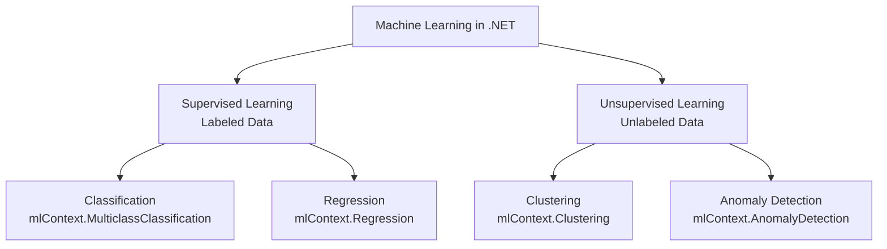
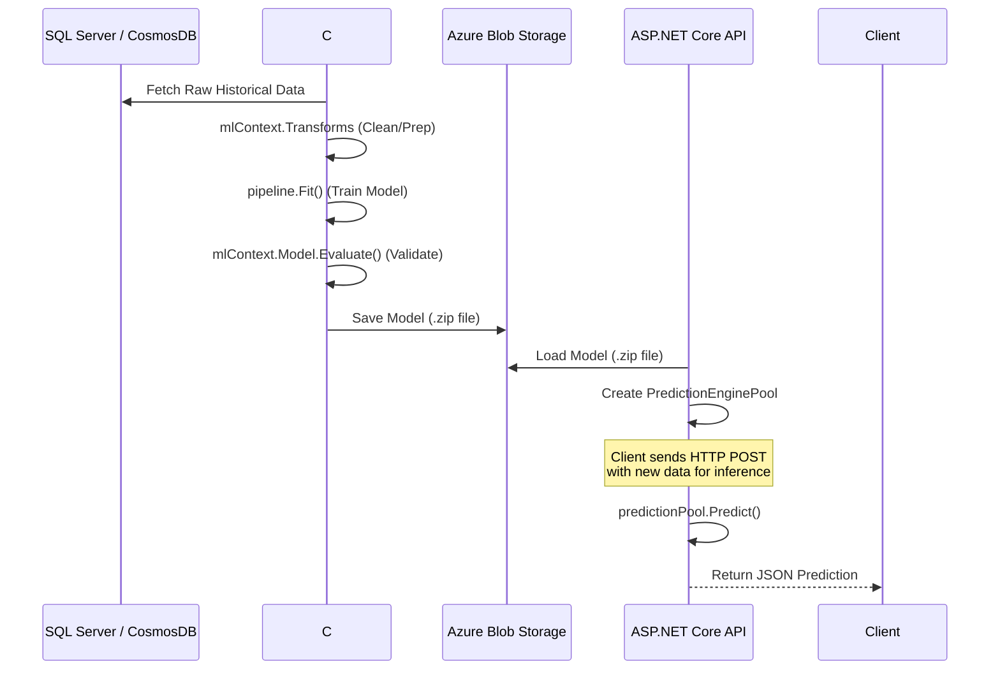

# Machine Learning (ML) Deep Dive in the .NET Ecosystem

Machine Learning is a dominant subset of AI consisting of algorithms that learn from data rather than being explicitly programmed with rules. 

Instead of writing `if-else` statements, you provide data, and the algorithm figures out the rules. As a C# developer, you can achieve this completely within the .NET ecosystem using **ML.NET**, a cross-platform, open-source machine learning framework specifically built for .NET developers.

## 🛠️ The Two Core Steps of ML using ML.NET

1. **Training:** Teaching the system to learn patterns from historical data. In .NET, this is done by building a pipeline with `MLContext`.
2. **Inference (Prediction):** Using the trained logic/model to make predictions on new, unseen data, typically using a `PredictionEngine`.

### 🏗️ .NET / Coding Analogy:

Instead of relying on Python for model training, you can do it natively in C#:

```csharp
using Microsoft.ML;
using Microsoft.ML.Data;

// 1. Initialize MLContext (The starting point for all ML.NET operations)
var mlContext = new MLContext();

// 2. Load Data
IDataView trainingData = mlContext.Data.LoadFromTextFile<HouseData>("housing.csv", hasHeader: true, separatorChar: ',');

// 3. Build Training Pipeline
var pipeline = mlContext.Transforms.Concatenate("Features", new[] { "Size", "Rooms" })
    .Append(mlContext.Regression.Trainers.Sdca(labelColumnName: "Price", maximumNumberOfIterations: 100));

// 4. Training Phase (Heavy computation, but natively in .NET)
var model = pipeline.Fit(trainingData);

// 5. Inference Phase (Production usage)
var predictionEngine = mlContext.Model.CreatePredictionEngine<HouseData, HousePrediction>(model);
var newHouse = new HouseData { Size = 1500, Rooms = 3 };
var prediction = predictionEngine.Predict(newHouse);

Console.WriteLine($"Predicted House Price: {prediction.Price:C}");
```

---

## 🌳 Types of Machine Learning via ML.NET Tasks

Here is a visual breakdown of the three main types of Machine Learning and their corresponding ML.NET Tasks:



### A. Supervised Learning
Models learn from **labeled data** (data where the input and the expected output are both known). It is like a teacher supervising a student, giving them the questions and the answers to study from.

**1. Classification:** Predicting predefined categories or classes.
- *Binary Classification (`mlContext.BinaryClassification`):* Output has only two categories.
    - *Example:* Spam vs. Not Spam, Yes vs. No.
    - *.NET Scenario:* A background worker scanning incoming user comments to flag "Toxic" or "Not Toxic" text.
- *Multi-Class Classification (`mlContext.MulticlassClassification`):* Output has more than two categories.
    - *Example:* Sentiment analysis categorizing text as Positive, Negative, or Neutral.
    - *.NET Scenario:* Categorizing GitHub issues automatically into "Bug", "Enhancement", or "Question".

**2. Regression (`mlContext.Regression`):** Predicting a continuous numerical output by finding the relationship between dependent and independent variables.
- *Examples:* Estimating food delivery time, stock price forecasting, or property price prediction.
- *.NET Scenario:* A Blazor dashboard predicting expected monthly sales revenue based on historical ad spend and seasonality factors.

---

### B. Unsupervised Learning
Models learn from **unlabeled/raw data** by finding hidden structures and patterns. There is no expected output provided during training.

**1. Clustering (`mlContext.Clustering`):** Grouping related data points together based on similarities.
    - *Example:* A news article is categorized into related themes.
    - *.NET Scenario:* Creating a recommendation engine in your ASP.NET Core e-commerce app by clustering users with similar purchasing patterns.

**2. Anomaly Detection (`mlContext.AnomalyDetection`):** Finding unusual patterns that do not conform to expected behavior.
    - *Example:* Spotting fraudulent credit card transactions.
    - *.NET Scenario:* Analyzing an IIS web server's application logs stream to instantly raise an alert when an uncharacteristically high spike in traffic or errors occurs.

---

## 🏗️ ML Model Lifecycle in .NET Architecture



---

## 📚 Official Resources for Further Study
- [ML.NET Documentation (Microsoft Learn)](https://learn.microsoft.com/en-us/dotnet/machine-learning/)
- [ML.NET Tutorial: Predict Prices using Regression](https://learn.microsoft.com/en-us/dotnet/machine-learning/tutorials/predict-prices)

---

### ➡️ Navigation
- Return to **[Main Timeline: Day 1 README](./README.md)**
- Next Detailed Topic: **[Deep Learning & Neural Networks](./Deep-Learning-and-Neural-Networks.md)**
