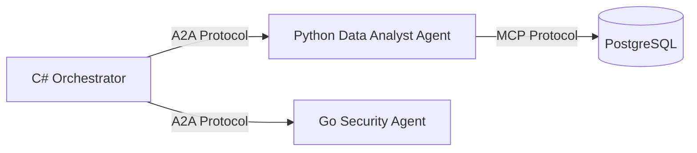

# Day 4: Multi-Agent Frameworks in .NET (2026)

> **Type:** 📖 Theory | **Time:** ~2 hours
>
> 🆕 *New for v4.0 (2026)*

---

## 🎯 Learning Objectives

- Compare the three major multi-agent frameworks in the .NET ecosystem.
- Choose the right framework for your enterprise use case.
- Understand the Agent-to-Agent (A2A) protocol.

---

## 📖 The Framework Landscape

As of 2026, building multi-agent systems is the primary way complex AI applications are developed. However, there are multiple frameworks to choose from.

### 1. Microsoft Agent Framework (MAF 1.0 GA)

- **What it is:** The official successor to Semantic Kernel. Deeply integrated with `Microsoft.Extensions.AI` and ASP.NET Core DI.
- **Best For:** Enterprise web APIs, microservices, and standard Orchestrator-Specialist patterns.
- **Pros:** Native C# feel, excellent dependency injection support, built-in OpenTelemetry.
- **Cons:** Strictly code-first; lacks some of the wild, experimental swarm topologies found in research frameworks.

### 2. AutoGen (AG2)

- **What it is:** The evolution of Microsoft's original AutoGen research project.
- **Best For:** Complex, conversational multi-agent simulations where agents debate each other to arrive at a solution.
- **Pros:** Incredible at autonomous problem solving. Supports complex group chats, sequential chats, and nested chats. 
- **Cons:** Can sometimes get stuck in endless debate loops. Harder to cleanly wrap behind a standard REST API response.

### 3. LangGraph .NET

- **What it is:** The .NET port of the popular Python LangGraph library.
- **Best For:** Highly deterministic, state-machine driven agent workflows.
- **Pros:** You explicitly define the "graph" of execution (Nodes and Edges). If Agent A fails, explicitly route to Agent B. Extremely predictable.
- **Cons:** Very boilerplate-heavy. You must manually define every possible state transition.

---

## 🌐 The Agent-to-Agent (A2A) Protocol

In Week 8, we discussed the **Model Context Protocol (MCP)**, which allows an Agent to talk to a Tool (like a database or an API).

In 2026, the industry standardized the **A2A (Agent-to-Agent) Protocol**. This allows an agent written in C# (using MAF) to seamlessly hand off a task to an agent written in Python (using LangGraph), running on a completely different server.

If you are building enterprise systems, you no longer build monoliths. You build **Agent Microservices** that communicate via A2A.

---

## 🔑 Key Takeaways

- Use **MAF** for standard enterprise applications and APIs.
- Use **LangGraph** when you need strict, deterministic state-machine control over the agent workflow.
- Use **AutoGen** for autonomous research and problem-solving simulations.
- **A2A** is the future of agent microservices.

---

## ➡️ Next

Continue to **[Day 5: Agent Observability](../Day-05-Agent-Observability/README.md)**
